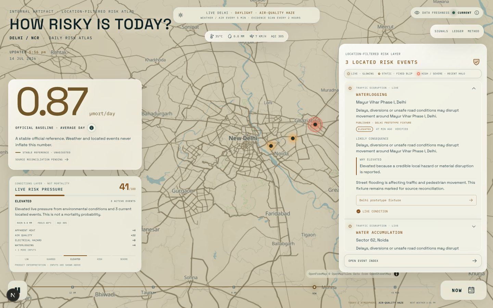

# How Risky is Today?

## A Policy Focused Prototype for Making Routine Urban Hazards Institutionally Traceable

**Live prototype:** [how-risky-is-today-delhi.netlify.app](https://how-risky-is-today-delhi.netlify.app) *(computer browser recommended)*

**Prepared by:** Raunaq Sharma; [raunaqqsharmaa@gmail.com](mailto:raunaqqsharmaa@gmail.com)

**Illustrated report:** [How Risky is Today - Complete Project Report.docx](report/How%20Risky%20is%20Today%20-%20Complete%20Project%20Report.docx)

## 1. Executive Summary

How Risky is Today? is an experimental risk atlas for India’s capital city, New Delhi, and the National Capital Region (NCR). The idea is the result of a simple observation about public life i.e the dangers that dominate public attention often differ from the dangers that consistently shape everyday movement through a city.

New Delhi, similar to other metro cities in India, has been notorious for civic issues, particularly flooded roads, open drains, exposed electrical cables, fire code failures etc., which have taken away several lives over the past couple of years[^1] - the most prominent out of these being the flooding of a coaching centre at the heart of the city, back during the monsoon season in 2024, which claimed the lives of three students that had been trapped in the basement of the coaching centre establishment, and eventually drowned due flooding in the surrounding areas.[^2] Later investigations revealed that the private establishment had flouted several norms, the most pertinent being the conversion of the basement into a library, illegally.[^3] While part of the blame rests on the private establishment, it is still unknown how it was allowed to flout norms for several years, without any action from the city’s civic authorities.[^4]

With regard to civic issues, official statistics record the aggregate harm only months or years later.[^5] Further, these statistics rarely meet in one place to tell a resident what their typical day looks like. In that regard, this project places a stable mortality reference, current environmental conditions, and recent location specific hazard indicators in one platform, while ensuring that the evidence is clear and traceable. As of now, the project should be looked upon as a policy design experiment in evidence transparency and civic accountability.

## 2. Problem Statement and Vision

Residents of a city experience policy through broken streetlights, flooded roads, exposed cables etc., all of which changes how they can move through a city. Official statistics, as highlighted above, are aggregated, while immediate information is referenced in a scattered manner through news reports and social media posts. This tends to create a communication gap, where annual figures show the scale of the harm, but are too abstract to describe the current conditions. Media houses highlight current events, but are selective and almost always driven by newsworthiness, while weather and air quality feeds describe the environment, but fail to delve into the institutional or mobility consequences. The understanding here is that each source has a unique evidentiary character and cannot be treated interchangeably.

The second gap, which is more important for policy, is the risk perception - this is shaped by familiarity, control, vividness, and media.[^6] A familiar daily danger for instance, seems normal, while a rare and dramatic one might seem ever present.[^7] This leads public pressure, administrative action, political support, and resource allocation to follow what is visible and recurrent, while routine hazards such as road crashes, unsafe infrastructure, open drains, flooded roads etc., become normalised conditions of our daily lives.

The vision is to build a public facing product that answers three questions in particular:

- What does ordinary everyday risk look like when expressed in understandable terms?

- What is happening around New Delhi NCR now that may affect safety or movement?

- When a particular disaster or hazard is preventable, what institution had the relevant duty, and what evidence exists about its response?

The project as of now is restricted to New Delhi NCR, since a bounded project makes it easier to confront inconsistent data, overlapping jurisdictions, lack or incomplete news coverage, and overlapping jurisdictions. The long term idea is to extend it to other metropolitan jurisdictions in India.

## 3. A Layered Model of Risk Communication

The core of this project rests on a layered model of risk communication:

### 3.1 A Stable Mortality Reference

The prototype displays a worked reference of roughly 0.87 micromorts for an average day, wherein, one micromort represents one in a million risk of death for a specified population or exposure.[^8] The prototype uses this reference as a conversion of an annual rate into an average day figure. Basically, it describes an average across a specified population, holds constant through the day, and is unaffected by weather or headlines. The long term aim is to replace the worked reference with a fully documented New Delhi NCR specific baseline.

### 3.2 Live Environmental Conditions

The atlas displays the current temperature and apparent heat, precipitation, cloud cover, wind, and air quality for New Delhi NCR. These conditions are represented visually to make the interface feel connected to the city as it exists at the moment. The air quality and current temperature are intended to feed into the live risk pressure (detailed below) and the eventual live mortality reference.

### 3.3 Located Risk Events

The system scrapes news and official alert sources and plots events that carry both a current risk mechanism such as waterlogging, fire, safety failure etc. and a plottable New Delhi NCR venue. The scraping process has been kept deliberately strict, such that generic political commentary and unlocated news stories are excluded. The main reason for doing this is because a smaller set of explainable points serves the public better than a visually dense feed. Every event has been labeled by a risk type, severity level, a live or static status, its location and age, and a direct link to the original publisher.

### 3.4 Live Risk Pressure

The live risk pressure tries to communicate the current conditions into a zero to hundred indicator. It takes into account the weather conditions, air quality, and the severity and freshness of active events. The distinguishing feature of the same is transparency, as the score is verifiable, allowing a user to see exactly which inputs pushed it up. The intention here is to present it as a teaching instrument, particularly with regard to how urban risks eventually stack.

### 3.5 The Accountability Ledger

This is the project’s centerpiece and it organises preventable hazards by the institutions with a relevant duty i.e a body that owns or maintains a public asset, or a regulator or enforcement agency, or a private contractor or property owner. Each attribution is careful with its claim, such that the attribution status has classifiers differentiated by reported, alleged, officially confirmed, disputed, or unknown. This allows the ledger to attribute responsibility, while staying fair and revisible. The intention is to eventually build the ledger over time by converting scattered incidents into a standardised public record of recurring failures and official responses.

## 4. Policy Significance

This project aims to make three contributions:

- First, it gives a working example of how small abstract risks can be given relevance and meaning, in a way that every claim is limited by its evidence, thus offering a working alternative of sorts to both static statistical dashboards and sensational live trackers.

- Second, it creates a framework for civic accountability. When preventable hazards are linked to institutional roles through a structured and transparent database with clear links, they tend to stir up an environment of accountability.

- Third, it acts as a harness for public reasoning. The interface nudges users to ask what is known, what is missing, and where a particular claim arose from - eventually helping build a public mindset that tests the very tenants of a democratic nation.

## 5. About Me and the Idea of Policy Led, AI Assisted Prototyping

[I am a Technology Policy researcher](https://www.linkedin.com/in/raunaq-sharma-a19318100/) in New Delhi, working across AI Governance, Platform Regulation, and Financial Fraud. A large part of my research work involved me in studying AI systems from the outside, through the lens of governance, and eventually, this led to a growing curiosity to understand what these systems can do, their limits, and how I can leverage the same in my day to day tasks.

This prototype is a result of that curiosity. The idea was to take a policy hypothesis that would usually end up as a concept note, and see whether AI tools could convert it into a working public artifact. AI holds a particular fascination for me because it shortens the distance between what a researcher can imagine and what a researcher can actually build. The dynamic nature of this field and the availability of new age tools every now and then, is a sort of an invitation to attempt something that was possibly out of reach a couple of years ago - this project is an example of the same.

Eventually, my goal is to deepen my technical skills by learning how to code, so that the next phase of this project focuses on technical fluency.

[^1]: Business Standard. (29 June 2024). [*Heavy rains pound Delhi; 5 dead, waterlogging, traffic snarls add to chaos.*](https://www.business-standard.com/india-news/heavy-rains-pound-delhi-5-dead-waterlogging-traffic-snarls-add-to-chaos-124062801357_1.html)
[^2]: Business Today. (28 July 2024). [*Delhi rains: 3 UPSC aspirants die after coaching centre’s basement gets flooded in Rajinder Nagar, probe ordered.*](https://www.businesstoday.in/india/story/delhi-rains-3-upsc-aspirants-die-after-coaching-centres-basement-gets-flooded-in-rajinder-nagar-probe-ordered-439135-2024-07-28)
[^3]: National Herald. (28 July 2024). [*Delhi coaching centre where 3 died falsely showed basement as store room in documents.*](https://www.nationalheraldindia.com/national/delhi-coaching-centre-where-3-died-falsely-showed-basement-as-store-room-in-documents)
[^4]: ANI. (20 September 2024). [*Rau’s IAS Study Circle case: Court dismisses plea seeking direction to change investigation officer, monitor probe.*](https://www.aninews.in/news/national/general-news/raus-ias-study-circle-case-court-dismisses-plea-seeking-direction-to-change-investigation-officer-monitor-probe20240920210153/)
[^5]: FACTLY. (22 April 2025). [*Data: As one awaits the release of the NCRB reports for 2023, here is how the delay in release of reports changed over time.*](https://factly.in/data-as-one-awaits-the-release-of-the-ncrb-reports-for-2023-here-is-how-the-delay-in-release-of-reports-changed-over-time/)
[^6]: Slovic, P. (1987). [*Perception of risk.*](https://www.science.org/doi/10.1126/science.3563507) *Science, 236(4799), 280-285.*
[^7]: Tversky, A., & Kahneman, D. (1973). [*Availability: A heuristic for judging frequency and probability.*](https://www.sciencedirect.com/science/article/abs/pii/0010028573900339) *Cognitive Psychology, 5(2), 207-232.*
[^8]: Plus Magazine. (12 July 2010). [*Understanding uncertainty: Small but lethal.*](https://plus.maths.org/content/os/issue55/features/risk/index)

---

## Reviewer Guide to This Repository

> **Authorship note:** Sections 1–5 above reproduce the project report body supplied by Raunaq Sharma, reformatted for Markdown and with its existing footnote links preserved. The repository guidance below, implementation, QA evidence, and illustrated appendices were prepared with AI assistance. See [AUTHORSHIP_AND_AI_ASSISTANCE.md](AUTHORSHIP_AND_AI_ASSISTANCE.md) for the detailed allocation.



This private repository is a self-contained local snapshot of **How Risky Is Today?** It allows a fellowship reviewer to inspect the policy idea, run the public interface locally, follow the methodological development trail, and examine selected quality-assurance evidence.

### Local repository versus live system

This repository is the **local prototype and source snapshot**. The deployed application remains a separate live system:

| Component | Live system | This local repository |
|---|---|---|
| Public interface | Hosted on Netlify | Runs at `http://localhost:3000` |
| Database | Supabase Postgres | No production database is bundled |
| Scheduled collection | Supabase Edge Functions, Cron and Vault | Function source is included; schedules do not run locally by default |
| Current events and conditions | Read from the live data pipeline | Falls back to clearly marked prototype fixtures when no environment variables are supplied |
| Secrets | Stored in Netlify/Supabase | Intentionally excluded |

The local version demonstrates the product, design, evidence model, and implementation. It is not a copy of the production database and will not reproduce the live site’s current event list without separately configured Supabase credentials.

### Run the prototype

On a Mac, double-click **`Start Local Prototype.command`**. On the first run it installs the packages and then starts the application at:

`http://localhost:3000`

Alternatively:

```bash
cd webapp
npm install
npm run dev
```

Node.js 24 LTS is recommended. The repository includes `.nvmrc`.

### What to inspect

- `report/` — the complete illustrated fellowship project report.
- `docs/PROJECT.md` — the original policy concept and early architecture.
- `docs/PLAN-REVIEW.md` — the evidence and measurement review that narrowed unsupported claims.
- `docs/fellowship.md` — the fellowship-oriented project dossier.
- `docs/rants.md` — a dated development diary recording major design and implementation changes.
- `webapp/` — the runnable application, tests, migrations, and ingestion-function source.
- `evidence/current-interface/` — desktop, mobile, and event-interaction captures.
- `evidence/development/` — concept-to-implementation comparison, a recorded QA correction, and an ingestion audit.
- `AUTHORSHIP_AND_AI_ASSISTANCE.md` — a candid allocation of authorship and AI-assisted work.
- `LOCAL_VS_LIVE.md` — a detailed explanation of the local/live boundary.
- `REPOSITORY_PROVENANCE.md` — what the Git history can and cannot establish.

### Accountability-ledger principle

The proposed ledger is not an administrator review queue and does not position the project creator or an AI system as the source of truth. A deployed record should show:

1. the authority named in identified reporting, an official statement, or a public jurisdiction/ownership record;
2. the evidence basis for showing that authority;
3. the action publicly reported; and
4. when necessary, the bounded status **“no public action recorded as of the last source check.”**

Reported responsibility, legal liability, and an adjudicated finding are not interchangeable.

### Verify the implementation

From `webapp/`:

```bash
npm run check
```

This runs linting, the risk-engine and risk-intelligence tests, and a production build.

### Data, security, and scope

The repository contains no production secret keys, database passwords, or private environment files. `.env.example` lists configuration names only. Do not add real credentials before sharing the repository.

This remains an experimental policy prototype. It is not an official warning service, a complete incident registry, a legal finding of responsibility, or a personal mortality calculator.
